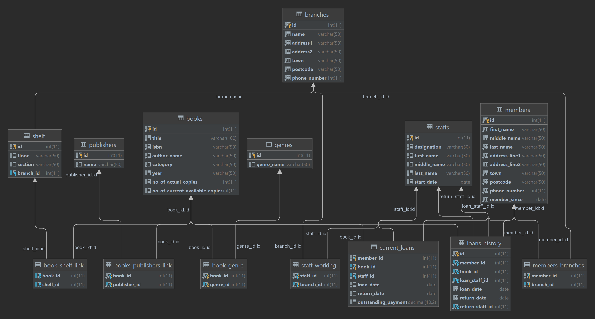

# Description

### Library Management System

This is a project to put my knowledge to test by creating a library management system by encompassing the possible real world problems. This project consists of 

- a database schema (MySQL)
- fake data generation tool (php)
- SQL to query the database
- SQL to verify that the fake data generator is creating sane data


[schema.sql](./schema.sql) file will shows how I got to the final product. I also included the change log, summarising all the changes I made through the project.


The fake data generator is a simple php script which uses the https://github.com/FakerPHP/Faker library. This library allows me to create random but sane data. The data is however usually random names or company names so some of the book titles don't really look like books you would find in the real world. But for the purposes of this project it works just fine.

### Running the database and data generation scripts

The `schema.sql` script can be easily executed as a raw SQL file either through a GUI or on the command line e.g.

```shell
mysql -uUSER -p SCHEMA_NAME < schema.sql
```

This will give you the empty database. You can then generate fake data using the script

```shell
cd fake
composer install
php generate.php 5 10 1000 30 10000 5000 500

# The generate.php script takes multiple arguments in order:
# Number of branches
# Number of staff per branch - Each branch will have equal staff members with a 30% chance of them being managers
# Number of members - All members will be randomly assigned a branch or multiple branches to be apart of
# Number of books - Books are randomly assigned to shelves 
# Number of historic loans
# Number of current loans
```


## Overview of the database

Here is the final version of the database



The idea was to create a library management system for multiple branches with staff working in these branches, members in multiple branches, books details, the current and loans history. 

In each of the branches, there are multiple floors with shelves and books. 

Each library is managed by several managers and a set of working staff. 

The same book could have several publishers.

The same book also could have more than one copy and not all are available to loan. 

Some books are on loaned, still on time to return and some are overdue with outstanding payment. 

The loans history to captured who loaned the book, what type of books are being loaned often and which staff processed the loaning and returning. 


## Future Expansion

This library system can be enhanced and expanded in a few areas. Whilst the database would not be used manually and would usually have some app / website which directly interacts with it. The database should help the app / website as much as possible by not allowing certain actions to happen:

- Books are currently can be on multiple shelves as there is a link table which stores this data. In the real world this is not possible so it would make more sense to store the location of the book on the book record itself.
- A book could be loaned out by a staff member or public member who is not a part of the branch where the book is housed.

## Changelog

### V1.0

This is my first trial project using SQL. I tried to imagine what a library would need and created some tables and relationships based on that. This is quite rough, just to get the some ideas rolling.

### V2.0

After creating the first database, I went back to take a look at all of the tables and fields created to see if they were consistent and to re-evaluate what I had created.

I noticed  the following:

- Some of the tables I had created were suffixed with `_table` which is unnecessary so they were cleaned up.
- Not all of the tables were plural, this was cleaned up where it made sense to do so. E.g. genre to genres. 
- The `publishers` table assumed that a publisher was linked directly to a book in a `1 to 1` mapping which is not correct as in the real world a single book can be published by multiple publishers at the same time. This was pulled apart into a link table.
- Also, the publisher year, no. of copies of the book and no. of current available copies is coherent to the book itself rather than the publisher. This has been moved to `books` table instead. 
- As the return date could let us know easily if the loaned books are on-time or overdue, the status column has been removed from current loan table. 
- The staff who process the book loaning and returning could be different as staff members could work on different locations or shift. Thus, has added return_staff column into `loan_history` table. 

### V3.0

Once I inserted all the fake data, I came up with a few questions to test the data sanity and if the database works. The questions and queries are as below: 

- [Number of available books in each branches](./Queries\number_of_books_per_branch.sql). 
- [How many books does each branch has](./Queries\how_many_books_does_each_branch_has.sql)?
- [How many member does each branch has](./Queries\how_many_member_does_each_branch_has.sql)? 
- [How many member has more than one branch membership](./Queries\how_many_member_has_more_than_one_branch_membership.sql)? 
- [What is the average members per branch](./Queries\what_is_the_average_members_per_branch.sql)? 
- [What is the most common book to be loaned out](./Queries\what_is_the_most_common_book_to_be_loaned_out.sql)? 
- [What is the most book loaned out based on genre](./Queries\what_is_the_most_book_loaned_out_based_on_genre.sql)? 
- [What is the average time of book being loaned](./Queries\what_is_the_average_time_of_book_being_loaned.sql)? 
- [Which branches the managers work at](./Queries\which_branches_the_managers_work_at.sql)?


